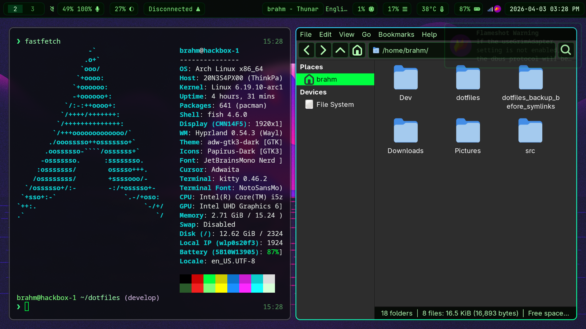

# dotfiles

Personal Linux desktop configuration centered on Hyprland, Fish, Waybar, Wofi, and terminal theming.

## Preview

Desktop layout:


Terminal and file manager:



## System Specs

This repo is currently used on a Lenovo ThinkPad T490 with:

- Arch Linux
- Linux kernel `6.19.10-arch1-1`
- Intel Core i5-8365U
- Intel UHD Graphics 620
- 15 GiB RAM
- 256 GB Samsung PM991a NVMe SSD
- 8 logical CPUs / 4 physical cores
- Thunderbolt 3 support

These specs are included only to describe the machine this setup was tuned on. No hostnames, serials, IP addresses, or MAC addresses are documented here.

## What is here

- `~/.config/hypr`: Hyprland, hypridle, and hyprpaper config
- `~/.config/waybar`: Waybar layout and styling
- `~/.config/wofi`: Wofi launcher config
- `~/.config/fish`: Fish shell config and prompt
- `~/.config/kitty`: Kitty theme and terminal behavior
- `~/.config/alacritty`: Alacritty theme and font settings
- `~/.config/mako` and `~/.config/dunst`: notification config
- `~/.config/gtk-3.0` and `~/.config/gtk-4.0`: GTK theme overrides
- `~/.config/picom`, `~/.config/flameshot`, `~/.config/pavucontrol`
- `~/.config/i3` and `~/.config/xfce4`: older or auxiliary desktop config

The current setup is mostly a green-on-dark theme with JetBrains Mono / Nerd Font styling across the desktop.

## Requirements

This repo assumes a Linux machine with at least some of these installed:

- `hyprland`
- `hypridle`
- `hyprpaper`
- `waybar`
- `wofi`
- `kitty`
- `alacritty`
- `fish`
- `mako` or `dunst`
- `nm-applet`
- `brightnessctl`
- `pavucontrol`
- `dolphin`
- JetBrains Mono / JetBrainsMono Nerd Font
- Papirus icons
- `adw-gtk3-dark`

Some binds and widgets also expect optional tools such as `hyprlauncher`, `hyprshutdown`, `hyprlock`, and MPD support.

## Install

There is no bootstrap script in this repo right now. The simplest approach is to symlink the tracked config into `$HOME`.

```bash
cd ~/dotfiles
mkdir -p ~/.config
find .config -type f | while read -r file; do
  mkdir -p "$HOME/$(dirname "$file")"
  ln -sf "$PWD/$file" "$HOME/$file"
done
```

If you prefer to inspect changes first, copy individual files manually instead of linking everything.

## Machine-specific notes

Before using this on another machine, review these paths and assumptions:

- `~/.config/hypr/hyprpaper.conf` uses an absolute wallpaper path under `/home/brahm/Pictures/...`
- `~/.config/waybar/config.jsonc` enables a second battery module for `BAT2`
- `~/.config/waybar/config.jsonc` references `~/.config/waybar/mediaplayer.py`
- `~/.config/waybar/config.jsonc` references `~/.config/waybar/power_menu.xml`
- Hyprland autostarts `nm-applet`, `hyprpaper`, `waybar`, `mako`, and a KDE polkit agent path at `/usr/lib/polkit-kde-authentication-agent-1`
- Wofi is configured to launch `alacritty` while Hyprland uses `kitty` as the main terminal

The referenced Waybar helper files are not currently tracked in this repo, so those sections may need to be removed or recreated on a fresh install.

## Repo notes

- `.gitignore` excludes common secret material such as keys, certs, `.env`, `.ssh/`, and `gnupg/`
- Several `*.bak` files are tracked as snapshots of earlier config revisions
